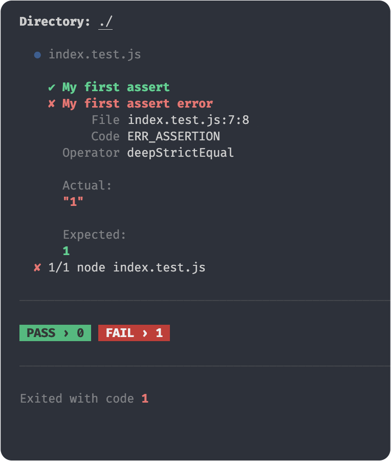
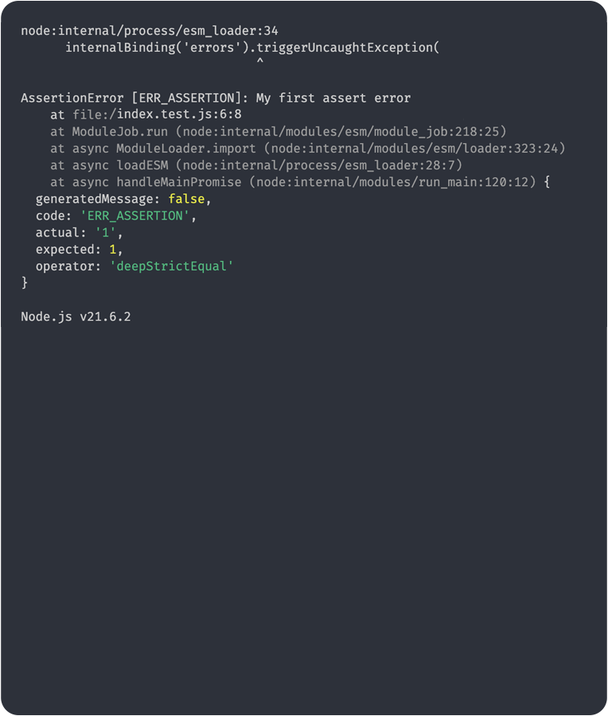

[node-version-url]: https://github.com/nodejs/node
[node-version-image]: https://img.shields.io/badge/Node.js->=6.0.0-badc58
[bun-version-url]: https://github.com/oven-sh/bun
[bun-version-image]: https://img.shields.io/badge/Bun->=0.5.3-f471b5
[deno-version-url]: https://github.com/denoland/deno
[deno-version-image]: https://img.shields.io/badge/Deno->=1.30.0-70ffaf
[typescript-url]: https://github.com/microsoft/TypeScript
[typescript-version-image]: https://img.shields.io/badge/TypeScript->=5.0.2-3077c6
[ci-url]: https://github.com/wellwelwel/poku/actions/workflows/ci.yml?query=branch%3Amain
[ci-image]: https://img.shields.io/github/actions/workflow/status/wellwelwel/poku/ci.yml?event=push&style=flat&label=CI&branch=main
[ql-url]: https://github.com/wellwelwel/poku/actions/workflows/codeql.yml?query=branch%3Amain
[ql-image]: https://img.shields.io/github/actions/workflow/status/wellwelwel/poku/codeql.yml?event=push&style=flat&label=Code%20QL&branch=main
[license-url]: https://github.com/wellwelwel/poku/blob/main/LICENSE
[license-image]: https://img.shields.io/npm/l/poku.svg?maxAge=2592000&color=9c88ff&label=License

# Poku


**Poku** is your test runner pet for [**Node.js**][node-version-url], [**Bun**][bun-version-url] and [**Deno**][deno-version-url] combining **flexibility**, **parallel** and **sequential** runs, **human-friendly assertion errors** and **high isolation level**.

> By creating **Poku**, my aim is to show that testing can be simpler.

[![Node.js Version][node-version-image]][node-version-url]
[![Bun Version][bun-version-image]][bun-version-url]
[![Deno Version][deno-version-image]][deno-version-url]
[![TypeScript Version][typescript-version-image]][typescript-url]
[![GitHub Workflow Status (with event)][ci-image]][ci-url]
[![GitHub Workflow Status (with event)][ql-image]][ql-url]
[![License][license-image]][license-url]

Enjoying **Poku**? Consider giving him a star ⭐️

---

🐷 [**Documentation Website**](https://poku.dev) • 🔬 [**Compare Poku with the Most Popular Test Runners**](https://poku.dev/docs/comparing)

---

## Why Poku?

Don't worry about `describe`, `it`, `beforeEach` and everything else 🚀 <br/>
After all, you don't need to learn what you already know ([**see why**](https://poku.dev/docs/examples/beforeEach)) ✨

- Supports **ESM** and **CJS**
- Designed to be highly intuitive
- Compatible with **Coverage** tools
- [**Node.js**][node-version-url], [**Bun**][bun-version-url] and [**Deno**][deno-version-url] compatibility
- Zero configurations, except you want
- Allows both **API (_in-code_)** and **CLI** usage
- Poku adapts to your test, not the other way around
- You can use **Poku**'s `assert` with every test runner you want
- [**And much more!**](https://poku.dev)

---

- [](https://packagephobia.com/result?p=poku)
- **Zero** external dependencies 🌱

---

## Documentation

- See detailed usage in [**Documentation**](https://poku.dev/docs/category/documentation) section for **Poku**'s **CLI**, **API (_in-code_)** and **assert**, advanced concepts and much more.

---

## Overview

### `poku`

| Sequential                                         | Concurrent                                       |
| -------------------------------------------------- | ------------------------------------------------ |
|  |  |

> [**See the complete `poku` documentation**](https://poku.dev/docs/category/poku).

---

### `assert`

| Using `poku`                                        | Using `node`                                        |
| --------------------------------------------------- | --------------------------------------------------- |
|  |  |

> [**See the complete assert's documentation**](https://poku.dev/docs/documentation/assert).

---

## Install

### **Node.js**

```bash
npm i -D poku
```

### TypeScript (Node.js)

```bash
npm i -D poku tsx
```

### Bun

```bash
bun add -d poku
```

### **Deno**

```ts
import { poku } from 'npm:poku';
```

---

## Quick Start

### CLI

> 

```bash
npx poku targetDir
```

> 

```bash
bun poku targetDir
```

> 

```bash
deno run npm:poku targetDir
```

### API (_In-code_)

#### Node.js, TypeScript (Node.js) and Bun

```ts
import { poku } from 'poku';

await poku(['targetDir']);
```

#### Deno

```ts
import { poku } from 'npm:poku';

await poku(['targetDir']);
```

---

To see the detailed documentation, please visit the [**Documentation**](https://poku.dev/docs/category/documentation) section in the [**Poku**'s website](https://poku.dev).

---

## Community

I'm continuously working to improve **Poku**. If you've got something interesting to share, feel free to submit a [**Pull Request**](https://github.com/wellwelwel/poku/compare). If you notice something wrong, I'd appreciate if you'd open an [**Issue**](https://github.com/wellwelwel/poku/issues/new).

---

## Acknowledgements

- [**Contributors**](https://github.com/wellwelwel/poku/graphs/contributors).

---

## Contributing

Please check the [**CONTRIBUTING.md**](./CONTRIBUTING.md) for instructions 🚀

---

## License

Poku is under the [**MIT** License](./LICENSE).

---

## Security Policy

Please check the [**SECURITY.md**](./SECURITY.md) and the section [**Is Poku Safe?**](https://poku.dev/docs/security) from Documentation.
