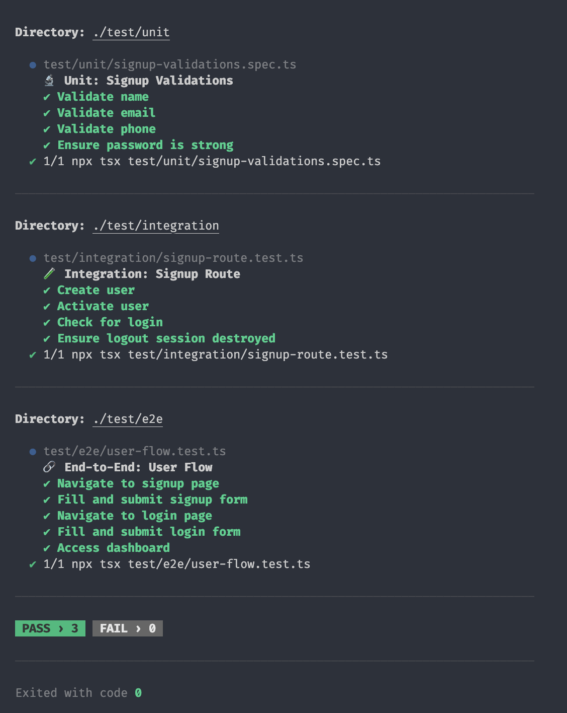
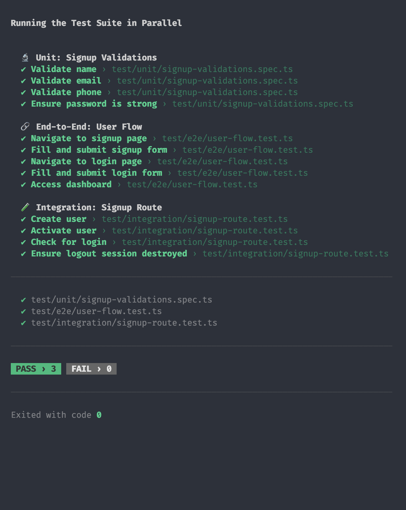
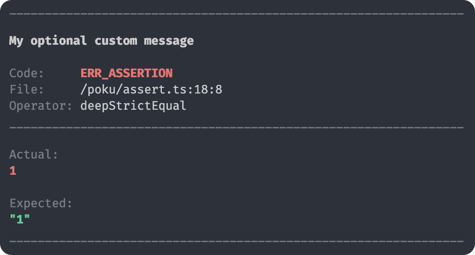

[node-version-url]: https://github.com/nodejs/node
[node-version-image]: https://img.shields.io/badge/Node.js->=6.0.0-badc58
[bun-version-url]: https://github.com/oven-sh/bun
[bun-version-image]: https://img.shields.io/badge/Bun->=0.5.3-f471b5
[deno-version-url]: https://github.com/denoland/deno
[deno-version-image]: https://img.shields.io/badge/Deno->=1.30.0-70ffaf
[npm-image]: https://img.shields.io/npm/v/poku.svg?color=3dc1d3
[npm-url]: https://npmjs.org/package/poku
[ci-url]: https://github.com/wellwelwel/poku/actions/workflows/ci.yml?query=branch%3Amain
[ci-image]: https://img.shields.io/github/actions/workflow/status/wellwelwel/poku/ci.yml?event=push&style=flat&label=CI&branch=main
[ql-url]: https://github.com/wellwelwel/poku/actions/workflows/codeql.yml?query=branch%3Amain
[ql-image]: https://img.shields.io/github/actions/workflow/status/wellwelwel/poku/codeql.yml?event=push&style=flat&label=Code%20QL&branch=main
[license-url]: https://github.com/wellwelwel/poku/blob/main/LICENSE
[license-image]: https://img.shields.io/npm/l/poku.svg?maxAge=2592000&color=9c88ff

# Poku


A flexible and easy-to-use **Test Runner** for [Node.js][node-version-url], [Bun][bun-version-url] and [Deno][deno-version-url] that allows you to run **parallel** and **sequential** tests, plus **high isolation level per test file**.

[![Node.js Version][node-version-image]][node-version-url]
[![Bun Version][bun-version-image]][bun-version-url]
[![Deno Version][deno-version-image]][deno-version-url]
[![NPM Version][npm-image]][npm-url]
[![License][license-image]][license-url]
[![GitHub Workflow Status (with event)][ci-image]][ci-url]
[![GitHub Workflow Status (with event)][ql-image]][ql-url]

---

## Why Poku?

> **Poku** starts from the premise where tests come to help, not overcomplicate: runs test files in an individual process per file, shows progress and exits 🧙🏻

- Supports **ESM** and **CJS**
- Designed to be highly intuitive
- No need to compile **TypeScript**
- Compatible with **Coverage** tools
- Allows both **in-code** and **CLI** usage
- [**Node.js**][node-version-url], [**Bun**][bun-version-url] and [**Deno**][deno-version-url] compatibility
- Zero configurations, except you want
- No constraints or rules, code in your own signature style

---

- 
- **Zero** external dependencies
- **Poku** dive to the deepest depths to find tests in the specified directories
- **Compatibility:** **Poku** is tested across all **Node 6+**, **Bun 0.5.3+** and **Deno 1.30+** versions
- **Poku** uses itself to test its own tests using `process.exit` at several depths on the same process node

---

| Sequential                                                   | Parallel                                                   |
| ------------------------------------------------------------ | ---------------------------------------------------------- |
| `npx poku test/unit,test/integration`                        | `npx poku --parallel test/unit,test/integration`           |
|  |  |

- By default, **Poku** searches for all _`.test.`_ files, but you can customize it using the option [`filter`](https://github.com/wellwelwel/poku#filter-rexexp).
- The same idea for [**Bun**][bun-version-url] and [**Deno**][deno-version-url] (see bellow).

---

**Poku** also includes the `assert` method, keeping everything as it is, but providing human readability:

```ts
import { assert } from 'poku'; // Node and Bun
import { assert } from 'npm:poku'; // Deno

assert(true);
assert.deepStrictEqual(1, '1', 'My optional custom message');
```

> 

---

## Install

### **Node.js**

> 

```bash
npm install --save-dev poku
```

### TypeScript (Node.js)

> 
> 
> 

```bash
npm install --save-dev poku tsx
```

### Bun

> 
> 
> 

```bash
bun add --dev poku
```

### **Deno**

> 
> 
> 

```ts
import { poku } from 'npm:poku';
```

- **Poku** requires these permissions by default: `--allow-read`, `--allow-env` and `--allow-run`.

---

## Basic Usage

### In-code

> 
> 
> 

```ts
import { poku } from 'poku';

await poku(['targetDirA', 'targetDirB']);
```

> 

```ts
import { poku } from 'npm:poku';

await poku(['targetDirA', 'targetDirB']);
```

### CLI

> 

```bash
npx poku targetDirA,targetDirB
```

> 

```bash
bun poku targetDirA,targetDirB
```

> 

```bash
deno run npm:poku targetDirA,targetDirB
```

---

## Documentation

> Website in Progress 🧑🏻‍🔧
>
> Initially, the documentation is based on **Node.js** usage, but you can use all the options normally for both **Bun** and **Deno**.

### `poku(targetDirs: string | string[])`

#### Include directories

- **in-code**

```ts
poku('targetDir');
```

```ts
poku(['targetDirA', 'targetDirB']);
```

- **CLI**

By setting the directories as the last argument:

> _Since **1.3.0**_

```bash
npx poku targetDir
```

```bash
npx poku targetDirA,targetDirB
```

By using `--include` option:

> _Since **1.0.0**_

```bash
npx poku --include='targetDir'
```

```bash
npx poku --include='targetDirA,targetDirB'
```

---

### `poku(targetDirs: string | string[], configs?: Configs)`

#### `parallel: boolean`

Determines the mode of test execution across **sequential** or **parallel** modes.

- **in-code**

```ts
/**
 * @default
 *
 * Sequential mode
 */

poku(['...'], {
  parallel: false,
});
```

```ts
/**
 * Parallel mode
 */

poku(['...'], {
  parallel: true,
});
```

- **CLI**

> _Since **1.2.0**_

```bash
# Parallel mode

npx poku --parallel ./test
```

---

#### `platform: "node" | "bun" | "deno"`

> _Since **1.2.0**_

By default, **Poku** tries to identify the platform automatically, but you can set it manually:

- **in-code**

```ts
/**
 * Force Node.js (or tsx for TypeScript)
 *
 * @default 'node'
 */

poku('...', {
  platform: 'node',
});
```

```ts
/**
 * Force Bun
 */

poku('...', {
  platform: 'bun',
});
```

```ts
/**
 * Force Deno
 */

poku('...', {
  platform: 'deno',
});
```

- **CLI**

```bash
# Normal

npx      poku      --platform=node  ./test
bun      poku      --platform=bun   ./test
deno run npm:poku  --platform=deno  ./test
```

```bash
# Custom
# When you're developing using a platform, but maintain compatibility with others

npx      poku      --platform=bun   ./test
bun      poku      --platform=deno  ./test
deno run npm:poku  --platform=node  ./test

# ...
```

---

#### `filter: RegExp`

By default, **Poku** searches for _`.test.`_ files, but you can customize it using the `filter` option.

> Filter by path using **Regex** to match only the files that should be performed.

- **in-code**

```ts
/**
 * @default
 *
 * Testing all `*.test.*` files.
 */

poku(['...'], {
  filter: /\.test\./,
});
```

```ts
/**
 * Testing all `ts`, `js`, `mts` and `mjs` files
 */

poku(['...'], {
  filter: /\.(m)?(j|t)s$/,
  // filter: /\.(js|ts|mjs|mts)$/,
});
```

- **CLI**

```bash
# Testing only a specific file

npx poku --filter='some-file' ./test
```

```bash
# Testing only a specific file

npx poku --filter='some-file|other-file' ./test
```

```bash
# Testing only paths that contains "unit"

npx poku --filter='unit' ./test
```

- **Environment Variable**

> By using `FILTER` from **Environment Variable**, it will overwrite the `filter` option.

```bash
# Testing only a specific file

FILTER='some-file' npx poku ./test
```

```bash
# Testing only a specific file

FILTER='some-file|other-file' npx poku ./test
```

```bash
# Testing only paths that contains "unit"

FILTER='unit' npx poku ./test
```

---

#### `exclude: RegExp | RegExp[]`

> Exclude by path using Regex to match only the files that should be performed.
>
> _Since **1.2.0**_

- **in-code**:

```ts
/**
 * Excluding  directories from tests
 */

poku(['...'], {
  exclude: /\/(helpers|tools)\//,
});
```

```ts
/**
 * Excluding  directories from tests
 */

poku(['...'], {
  exclude: [/\/helpers\//, /\/tools\//],
});
```

```ts
/**
 * Excluding specific files from tests
 */

poku(['...'], {
  exclude: /(index|common).test.ts/,
});
```

```ts
/**
 * Excluding specific files from tests
 */

poku(['...'], {
  exclude: [/index.test.ts/, /common.test.ts/],
});
```

```ts
/**
 * Excluding directories and files from tests
 */

poku(['...'], {
  exclude: /\/(helpers|tools)\/|(index|common).test.ts/,
});
```

```ts
/**
 * Excluding directories and files from tests
 */

poku(['...'], {
  exclude: [/\/helpers\//, /\/tools\//, /index.test.ts/, /common.test.ts/],
});
```

- **CLI**

```bash
# Excluding directories and files from tests

npx poku --exclude='some-file-or-dir' ./test
```

```bash
# Excluding directories and files from tests

npx poku --exclude='some-file-or-dir|other-file-or-dir' ./test
```

---

### Assert

> _Since **1.3.0**_
>
> [**Node.js**][node-version-url], [**Bun**][bun-version-url] and [**Deno**][deno-version-url] compatible.

**Poku** includes the `assert` method native from [**Node.js**][node-version-url], keeping everything as it is, but providing human readability.<br/>
It supports both [**Bun**][bun-version-url] and [**Deno**][deno-version-url].

#### Migrating to **Poku**'s assert

_But only if you want to, of course._

> 
> 
> 

```diff
- import assert from 'node:assert';
+ import { assert } from 'poku';

assert(true);
```

> 

```diff
- import assert from 'node:assert';
+ import { assert } from 'npm:poku';

assert(true);
```

#### Available methods

- `assert(value[, message])`
- `assert.deepEqual(actual, expected[, message])`
- `assert.deepStrictEqual(actual, expected[, message])`
- `assert.doesNotMatch(string, regexp[, message])`
- `assert.doesNotReject(asyncFn[, error][, message])`
- `assert.doesNotThrow(fn[, error][, message])`
- `assert.equal(actual, expected[, message])`
- `assert.fail([message])`
- `assert.ifError(value)`
- `assert.match(string, regexp[, message])`
- `assert.notDeepEqual(actual, expected[, message])`
- `assert.notDeepStrictEqual(actual, expected[, message])`
- `assert.notEqual(actual, expected[, message])`
- `assert.notStrictEqual(actual, expected[, message])`
- `assert.ok(value[, message])`
- `assert.rejects(asyncFn[, error][, message])`
- `assert.strictEqual(actual, expected[, message])`
- `assert.throws(fn[, error][, message])`

You can follow the [**assert documentation**](https://nodejs.org/api/assert.html) from **Node.js**'s documentation.

---

### `listFiles(targetDir: string, configs?: ListFilesConfigs)`

> _Since **1.2.0**_

Returns all files in a directory, independent of their depth.

```ts
listFiles('some-dir');
```

- You can use the `filter` and `exclude` options, as well as they are for **`poku`** method.

---

## Community

I'm continuously working to improve **Poku**. If you've got something interesting to share, feel free to submit a [**Pull Request**](https://github.com/wellwelwel/poku/compare). If you notice something wrong, I'd appreciate if you'd open an [**Issue**](https://github.com/wellwelwel/poku/issues/new).

---

## Acknowledgements

- [**Contributors**](https://github.com/wellwelwel/poku/graphs/contributors)
